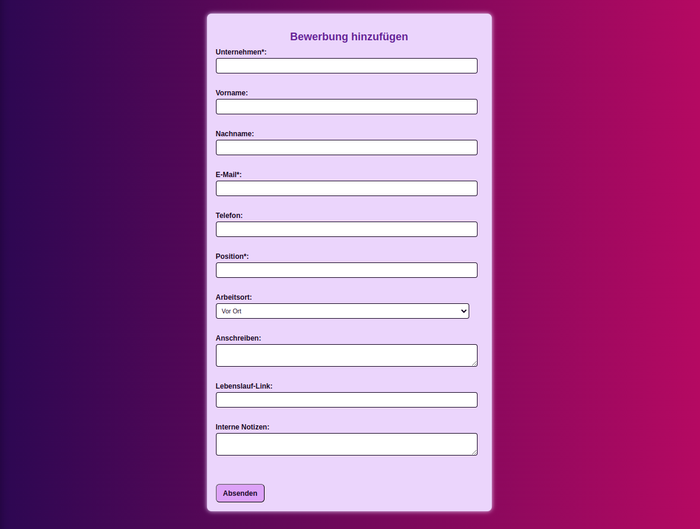
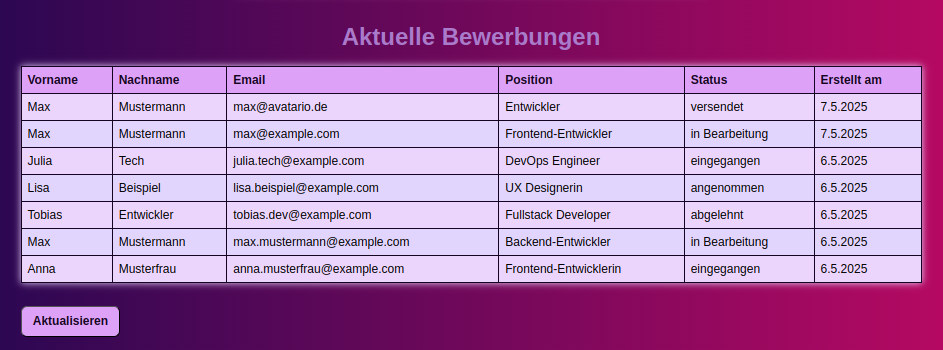

 

# Backend-Collab-Project

 
  
Table of Contents

  <ol>
    <li><a href="#about-the-project">About The Project</a></li>
    <li><a href="#contributing">Contributing</a></li>
    <li><a href="#built-with">Built With</a></li>
    <li><a href="#construction">Construction</a></li>
    <li><a href="#contact">Contact</a></li>
  </ol>

 

## About The Project

Task:

* Teamwork 👭:  create a small Backend-Project;

* Time ⏳:  3 days;

* About ❓:  free choice;

* Programming-language 👩‍💻:  free choice;

What we decided to do:

* Building an App for Application-Documentation 📨 

(<a href="#readme-top">back to top</a>)
 

## Contributing

Involved in the project:

* Marga Lensen 
* Sonja Linhard 
* Doris Pasic 

(<a href="#readme-top">back to top</a>)
 

## Built With

* HTML5
* CSS
* JavaScript
* express
* mongoose

(<a href="#readme-top">back to top</a>)

## Construction

Documentation of construction: [@Journal.md](https://github.com/Marga-Lensen/backend-collab-project/blob/main/misc_Notizen/Journal.md)

(<a href="#readme-top">back to top</a>)

## Contact

Marga Lensen - [@GitHub](https://github.com/Marga-Lensen).

Sonja Linhard - [@GitHub](https://github.com/SoLin26).

Doris Pasic - [@Wonderlink](https://wonderl.ink/@dorispasicstudio) - [@GitHub](https://github.com/DorisPasic).

(<a href="#readme-top">back to top</a>)

<link rel="preconnect" href="https://fonts.googleapis.com">
<link rel="preconnect" href="https://fonts.gstatic.com" crossorigin>
<link href="https://fonts.googleapis.com/css2?family=Amaranth:ital,wght@0,400;0,700;1,400;1,700&family=Anton&family=Dancing+Script:wght@400..700&display=swap" rel="stylesheet">

